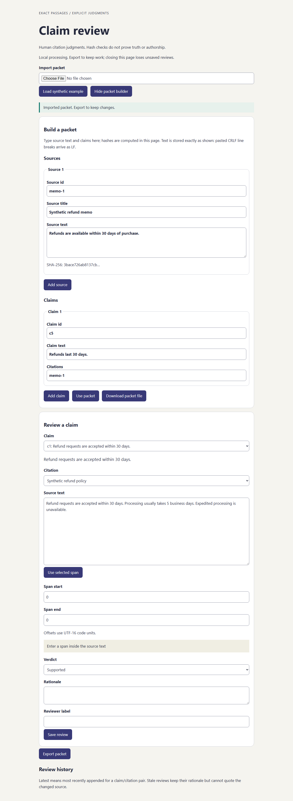

# Claim review

Record why a specific passage supports, partly supports, contradicts or cannot
verify a claim. Import frozen source text, select an exact span, enter a rationale
and export portable human review history. No account, model or server.



## Use

Open the GitHub Pages app or download the standalone HTML/offline ZIP from this
repository's Releases. Start with **New packet** (type sources and claims; hashes are
computed in the page and pasted CRLF arrives as LF), **Load synthetic example**, or
**Import packet**. Choose a claim/citation, select source text with **Use selected span**
or enter numeric offsets, choose a verdict, write rationale and reviewer label, then
save. **Export packet** preserves all review history. Reimport that JSON to continue.
The status line turns red and announces errors; leaving with unsaved reviews triggers
the browser guard.

Closing without export loses reviews. Processing stays in memory: no upload,
source fetch, telemetry, local storage or background persistence. Reviewer labels
are self-reported. Source rights and exported file sharing remain your responsibility.

## What it verifies

SHA-256 of supplied valid Unicode source text, exact UTF-16 span boundaries,
references, schema and history integrity. A changed source hash makes old reviews
stale; their rationale remains, but the old passage is unavailable and never
quoted from the new text. Latest means last appended per claim/citation pair.

Hash consistency is not truth, authorship or semantic entailment. These are human
judgments, not automated accuracy scores. No W3C Web Annotation compatibility
claim. English UI preserves Unicode/Arabic text; manual screen-reader coverage
is unverified. [Contract](docs/contract.md), [evaluation](docs/evaluation.md),
[bounded usefulness](docs/usefulness.md), [provenance](docs/provenance.md).

## Develop

Node 22.23.2 (minimum 22.12), locked dev-only dependencies:

```sh
npm ci
npm run check
npx playwright install chromium firefox webkit
npm run test:browser
```

Build creates dist/index.html with inline CSS and one classic bundled script.
`node scripts/serve.mjs` serves only that build at 127.0.0.1:4173. No runtime package
or shared-repo dependency. Browser tests include keyboard navigation, exact exports,
builder create/review/export/reimport, invalid-input recovery, error-role styling,
invalid-import preservation, inert script text and offline local file operation.

MIT code; original CC0 synthetic AI-assisted non-client examples. Demand, adoption,
production ownership, annotator reliability and semantic accuracy remain unproven.
